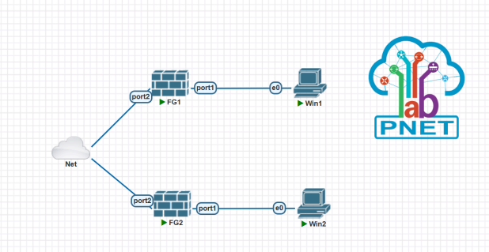
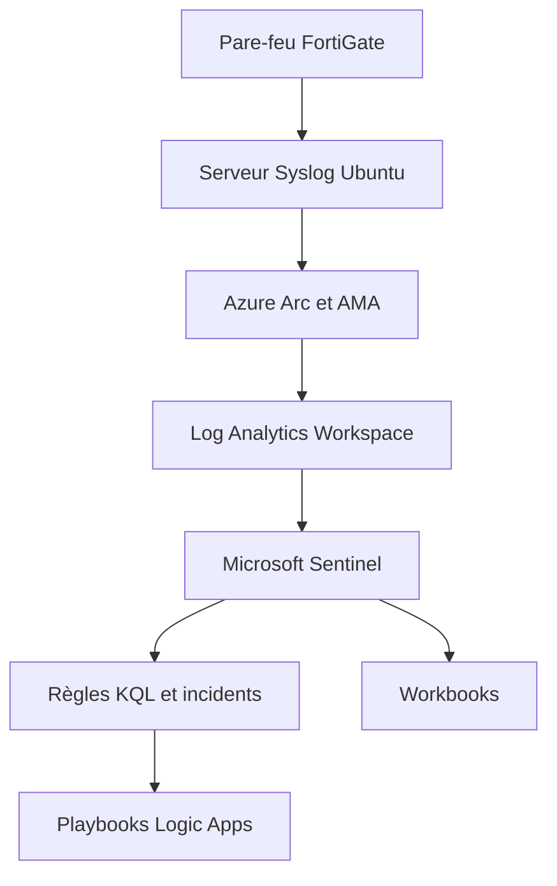

# Architecture SIEM/SOAR hybride avec FortiGate et Microsoft Sentinel

## Présentation

Ce projet a été réalisé dans le cadre de mon Projet de Fin d’Année en cybersécurité.

Il porte sur la conception et le déploiement d’une architecture hybride de détection et de réponse aux incidents de sécurité, combinant une infrastructure locale simulée dans PNetLab avec les services cloud Microsoft Azure.

La solution assure la centralisation des journaux de sécurité, leur transmission vers Microsoft Sentinel, la détection des activités suspectes et l’automatisation de certaines actions de réponse.

> Ce dépôt présente une version publique et anonymisée du projet. Les identifiants, secrets, adresses IP publiques et informations sensibles ont été supprimés ou remplacés.

---

## Objectifs du projet

* Concevoir une architecture de supervision hybride On-Premise/Cloud.
* Interconnecter deux réseaux avec un VPN IPsec Site-to-Site.
* Configurer des pare-feu FortiGate et leurs politiques de sécurité.
* Centraliser les événements FortiGate sur un serveur Syslog.
* Connecter le serveur local à Microsoft Azure avec Azure Arc.
* Collecter et analyser les journaux dans Microsoft Sentinel.
* Développer des règles de détection avec Kusto Query Language (KQL).
* Générer et analyser des incidents de sécurité.
* Automatiser certaines réponses avec Azure Logic Apps.
* Construire des tableaux de bord avec Microsoft Sentinel Workbooks.

---

## Architecture générale

L’environnement du projet repose sur deux parties principales :

### Infrastructure locale simulée

* PNetLab pour la virtualisation du réseau.
* Deux pare-feu FortiGate.
* Deux réseaux locaux distincts.
* Deux machines Windows utilisées pour les tests.
* Un tunnel VPN IPsec Site-to-Site.
* Une machine Ubuntu utilisée comme serveur Syslog.
* Centralisation des journaux générés par les pare-feu.

### Infrastructure cloud

* Microsoft Azure.
* Microsoft Sentinel.
* Log Analytics Workspace.
* Azure Arc.
* Azure Monitor Agent.
* Data Collection Rules.
* Azure Logic Apps.
* Microsoft Sentinel Workbooks.
* Machines virtuelles Azure.
* VPN Site-to-Site entre deux réseaux virtuels Azure.



---

## Fonctionnement de la solution



Les pare-feu FortiGate transmettent leurs journaux au serveur Syslog. Le serveur est connecté à Azure par Azure Arc et utilise Azure Monitor Agent pour envoyer les événements au Log Analytics Workspace.

Microsoft Sentinel analyse ensuite les données à l’aide de règles analytiques basées sur des requêtes KQL. Lorsqu’une activité suspecte est détectée, un incident est créé et un playbook Logic Apps peut être exécuté.

---

## Technologies utilisées

| Domaine                | Technologies                 |
| ---------------------- | ---------------------------- |
| SIEM                   | Microsoft Sentinel           |
| SOAR                   | Azure Logic Apps             |
| Pare-feu               | FortiGate                    |
| Collecte des journaux  | Rsyslog, Azure Monitor Agent |
| Cloud                  | Microsoft Azure              |
| Connexion hybride      | Azure Arc                    |
| Analyse des événements | Kusto Query Language         |
| Visualisation          | Microsoft Sentinel Workbooks |
| Réseau                 | VPN IPsec Site-to-Site       |
| Virtualisation réseau  | PNetLab                      |
| Systèmes               | Ubuntu Server, Windows       |
| Stockage des journaux  | Log Analytics Workspace      |

---

## Étapes de réalisation

### 1. Construction de l’environnement réseau

Deux réseaux locaux ont été créés dans PNetLab. Chaque réseau contient un pare-feu FortiGate et une machine Windows.

Les interfaces réseau, routes statiques et politiques de filtrage ont ensuite été configurées.


### 2. Configuration du VPN IPsec

Un tunnel VPN IPsec Site-to-Site a été établi entre les deux pare-feu FortiGate afin de permettre une communication sécurisée entre les deux réseaux.

Les tests de connectivité ont permis de vérifier :

* l’état du tunnel VPN ;
* la communication entre les réseaux ;
* le routage du trafic ;
* l’application des politiques de sécurité.


### 3. Mise en place du serveur Syslog

Une machine Ubuntu Server a été configurée avec `rsyslog` afin de centraliser les journaux provenant des deux pare-feu.

Les configurations réalisées comprennent :

* l’activation de la réception Syslog ;
* l’utilisation des protocoles UDP et TCP ;
* l’ouverture des ports nécessaires ;
* la séparation des journaux selon leur source ;
* la vérification de la réception des événements.


### 4. Intégration avec Microsoft Sentinel

Un Log Analytics Workspace a été créé et Microsoft Sentinel a été activé.

Le serveur Syslog a ensuite été connecté à Azure à l’aide des composants suivants :

* Azure Arc ;
* Azure Monitor Agent ;
* Data Collection Rule ;
* connecteur Syslog de Microsoft Sentinel.


### 5. Développement des règles de détection

Des règles analytiques ont été configurées afin d’identifier des événements suspects dans les journaux collectés.

Les requêtes KQL permettent notamment de :

* rechercher les échecs d’authentification ;
* identifier des connexions inhabituelles ;
* suivre les événements critiques ;
* regrouper les événements associés ;
* générer automatiquement des incidents.

Exemple simplifié et anonymisé :

```kusto
Syslog
| where TimeGenerated > ago(1h)
| where SeverityLevel in ("err", "crit", "alert", "emerg")
| summarize EventCount = count() by HostName, ProcessName
| order by EventCount desc
```

Les requêtes présentées dans ce dépôt utilisent uniquement des données anonymisées.

### 6. Gestion des incidents

Les événements correspondant aux conditions des règles analytiques génèrent des alertes et des incidents dans Microsoft Sentinel.

L’analyse d’un incident comprend :

* l’identification de la source ;
* l’examen des événements associés ;
* la qualification de l’incident ;
* l’évaluation de la sévérité ;
* la consultation de la chronologie ;
* l’application des actions de réponse.


### 7. Automatisation de la réponse

Des playbooks basés sur Azure Logic Apps ont été configurés pour automatiser certaines opérations après la création d’un incident.

Les automatisations réalisées ou étudiées comprennent :

* l’envoi d’une notification ;
* la récupération des informations de l’incident ;
* l’enrichissement des données ;
* la mise à jour de l’incident ;
* le déclenchement d’une action après validation.


### 8. Création des tableaux de bord

Des workbooks Microsoft Sentinel ont été utilisés pour présenter les informations importantes du SOC :

* nombre d’événements collectés ;
* incidents par niveau de sévérité ;
* évolution temporelle des alertes ;
* machines les plus concernées ;
* sources principales des événements ;
* état général de la supervision.


---

## Scénarios de validation

Les principaux tests réalisés dans le laboratoire comprennent :

| Test                                    | Objectif                                             | Résultat |
| --------------------------------------- | ---------------------------------------------------- | -------- |
| Connectivité locale                     | Vérifier la communication dans chaque réseau         | Validé   |
| VPN IPsec                               | Vérifier la communication entre les deux réseaux     | Validé   |
| Collecte Syslog                         | Vérifier la réception des journaux FortiGate         | Validé   |
| Transmission vers Azure                 | Vérifier l’arrivée des événements dans Log Analytics | Validé   |
| la communication entre les deux réseaux | Validé                                               |          |
| Collecte Syslog                         | Vérifier la réception des journaux FortiGate         | Validé   |
| Transmission vers Azure                 | Vérifier l’arrivée des événements dans Log Analytics | Validé   |
| Règles analytiques                      | Vérifier la génération d’alertes                     | Validé   |
| Création d’incidents                    | Vérifier la corrélation des événements               | Validé   |
| Playbooks                               | Vérifier l l’automatisation de la réponse            | Validé   |
| Workbooks                               | Vérifier la visualisation des indicateurs            | Validé   |

---

## Résultats obtenus

Le projet a permis de mettre en place une chaîne complète de supervision :

1. génération des événements dans l’infrastructure ;
2. centralisation des événements sur le serveur Syslog ;
3. transmission sécurisée vers Microsoft Azure ;
4. ingestion dans le Log Analytics Workspace ;
5. analyse avec Microsoft Sentinel ;
6. détection des événements suspects ;
7. création des incidents ;
8. automatisation des actions ;
9. visualisation des indicateurs de sécurité.

Cette architecture démontre la complémentarité entre les équipements de sécurité On-Premise et les capacités de détection et d’automatisation d’un SIEM/SOAR cloud.

---

## Compétences développées

* Conception d’architectures de sécurité hybrides.
* Administration et configuration de pare-feu FortiGate.
* Mise en place de VPN IPsec Site-to-Site.
* Centralisation et analyse des journaux Syslog.
* Déploiement et configuration de Microsoft Sentinel.
* Intégration de machines locales avec Azure Arc.
* Création de Data Collection Rules.
* Développement de requêtes KQL.
* Création de règles analytiques.
* Investigation d’incidents de sécurité.
* Automatisation avec Azure Logic Apps.
* Création de workbooks de supervision.
* Tests, diagnostic et résolution de problèmes techniques.

---

## Difficultés rencontrées

Les principales difficultés rencontrées concernaient :

* la configuration du routage entre les réseaux ;
* l’établissement du VPN IPsec ;
* la transmission des journaux FortiGate ;
* l’intégration du serveur Syslog avec Azure ;
* la construction et la validation des requêtes KQL ;
* le déclenchement automatique des play playbooks ;
* la vérification de la collecte des données.

Ces difficultés ont été traitm corrigées progressivement grâce à l’analyse des journaux, aux tests de connectivité et à la validation de chaque composant de l’architecture.

---

## Améliorations possibles

* Ajouter une solution EDR aux machines supervisées.
* Intégrer d’autres sources de journaux.
* Développer des règles KQL supplémentaires.
* Associer les détections aux techniques MITRE ATT&CK.
* Ajouter un enrichissement de Threat Intelligence.
* Automatiser le blocage d’une adresse IP malveillante.
* Automatiser l’isolation d’une machine compromise.
* Mettre en place un mécanisme Human-in-the-Loop pour les actions sensibles.

---

## Avertissement

Ce projet a été réalisé dans un environnement de laboratoire contrôlé à des fins pédagogiques.

Les adresses IP publiques, mots de passe, clés VPN, secrets Azure, identifiants, informations personnelles et données liées à l’entreprise ont été retirés ou remplacés.

Aucune information confidentielle ni donnée appartenant à l’organisme d’accueil n’est publiée dans ce dépôt.

---

## Auteure

**Maryeme Aftyss**
Ingénieure d’État en cybersécurité
Spécialisation : SOC, SIEM, SOAR, réseaux et sécurité opérationnelle

